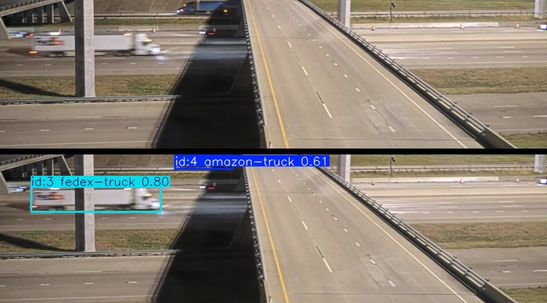
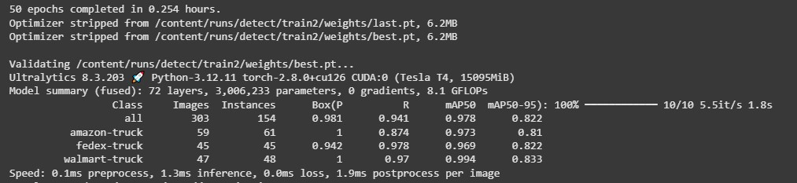

# Detector de Frotas Logísticas com YOLOv8 para Ambiente Controlado



## 📜 Descrição do Projeto

Este projeto utiliza Visão Computacional para detectar e rastrear em tempo real caminhões de frotas logísticas específicas (Amazon, FedEx e Walmart). 

A proposta principal foi desenvolver um modelo **super preciso e o mais leve possível**, otimizado para um **ambiente controlado**: uma câmera com posição fixa transmitindo uma rodovia ao vivo. Por ser altamente especializado, o modelo pode não ter o mesmo desempenho em outros ângulos de câmera ou condições de iluminação.

O processo de desenvolvimento incluiu a criação de um dataset customizado, o treinamento iterativo de um modelo YOLOv8 e a implementação de scripts Python para análise.

**Vídeo de Origem dos Dados:** Todas as imagens de treinamento foram capturadas da transmissão ao vivo do YouTube: [https://www.youtube.com/watch?v=L6hknNiZr-w](https://www.youtube.com/watch?v=L6hknNiZr-w)

## 🛠️ Tecnologias Utilizadas

-   **Linguagem:** Python
-   **Machine Learning:** Ultralytics YOLOv8
-   **Processamento de Imagem:** OpenCV
-   **Plataforma de Dados:** Roboflow
-   **Ambiente de Treinamento:** Google Colab (GPU)

## 📊 Dataset

O dataset foi construído do zero, a partir da captura de imagens da transmissão do YouTube. Ele contém mais de 1500 imagens anotadas e está publicamente disponível no Roboflow.

**[Acesse o Dataset no Roboflow](https://app.roboflow.com/testerodovia/rodovia-v8iif/8)**

## ⚙️ Como Testar o Modelo

1.  **Clone o repositório:**
    ```bash
    git clone https://github.com/fabrenan/detector-frotas-rodovia.git
    cd detector-frotas-rodovia
    ```

2.  **Instale as dependências:**
    ```bash
    pip install -r requirements.txt
    ```

3.  **Execute o script principal:**
    a. Abra o arquivo `main.py`.
    b. Altere a variável `caminho_video` para o caminho do seu arquivo de vídeo.
    c. Salve e execute o script no terminal:
    ```bash
    python main.py
    ```

## 📈 Resultados do Treinamento

O modelo foi treinado por 50 épocas, alcançando uma métrica **mAP50-95 de 0.822**.



| Classe         | Precisão (P) | Recall (R) | mAP50 | mAP50-95 |
|----------------|--------------|------------|-------|----------|
| **all** | **0.981** | **0.941** | **0.978** | **0.822** |
| amazon-truck   | 1.00         | 0.874      | 0.973 | 0.810    |
| fedex-truck    | 0.942        | 0.978      | 0.969 | 0.822    |
| walmart-truck  | 1.00         | 0.970      | 0.994 | 0.833    |

**Velocidade de Inferência:** Apenas **1.3ms** por imagem em uma GPU Tesla T4.
